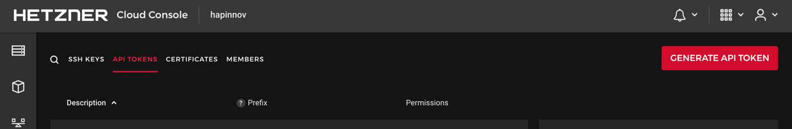

# Terraform Kubernetes on Hetzner Cloud

This repository will help to setup a Kubernetes Cluster with [kubeadm](https://kubernetes.io/docs/setup/independent/create-cluster-kubeadm/) on [Hetzner Cloud](https://www.hetzner.com/cloud?country=us).

### Initial setup

create a token in hetzner console.




## Usage

To create a kubernetes with one master and 2 nodes

```
$ terraform init
$ terraform apply -var="hcloud_token=token" -var="node_count=2"
```

you can create kubernetes with one node by update the node_count variable to 1

```
$ terraform init
$ terraform apply -var="hcloud_token=token" -var="node_count=1"
```


## Container Storage Interface driver for Hetzner Cloud


1. Create a secret containing the token:

   ```
   # secret.yml
   apiVersion: v1
   kind: Secret
   metadata:
     name: hcloud-csi
     namespace: kube-system
   stringData:
     token: YOURTOKEN
   ```

   and apply it:
   ```
   kubectl apply -f <secret.yml>
   ```
   

2. Deploy the CSI driver and wait until everything is up and running:

   Have a look at our [Version Matrix](README.md#versioning-policy) to pick the correct deployment file.
   ```
   kubectl apply -f https://raw.githubusercontent.com/hetznercloud/csi-driver/v1.5.1/deploy/kubernetes/hcloud-csi.yml


3. To verify everything is working, create a persistent volume claim and a pod
   which uses that volume:

   ```
   apiVersion: v1
   kind: PersistentVolumeClaim
   metadata:
     name: csi-pvc
   spec:
     accessModes:
     - ReadWriteOnce
     resources:
       requests:
         storage: 10Gi
     storageClassName: hcloud-volumes
   ---
   kind: Pod
   apiVersion: v1
   metadata:
     name: my-csi-app
   spec:
     containers:
       - name: my-frontend
         image: busybox
         volumeMounts:
         - mountPath: "/data"
           name: my-csi-volume
         command: [ "sleep", "1000000" ]
     volumes:
       - name: my-csi-volume
         persistentVolumeClaim:
           claimName: csi-pvc
   ```

   Once the pod is ready, exec a shell and check that your volume is mounted at `/data`.

   ```
   kubectl exec -it my-csi-app -- /bin/sh
   ```
   
more info : [Container Storage Interface driver for Hetzner Cloud](https://github.com/hetznercloud/csi-driver)
